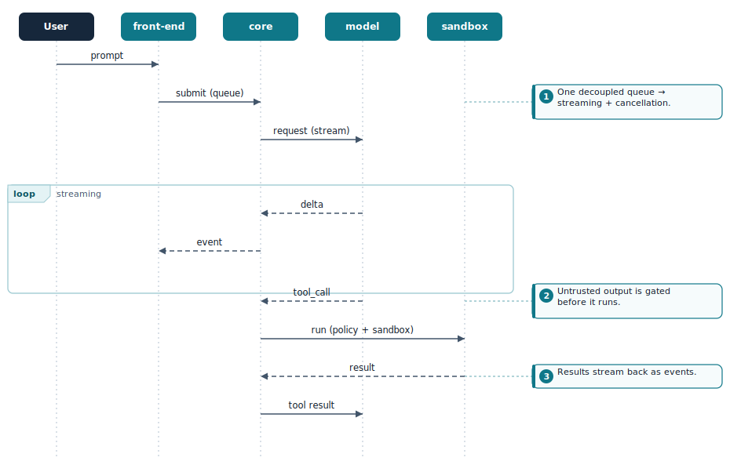
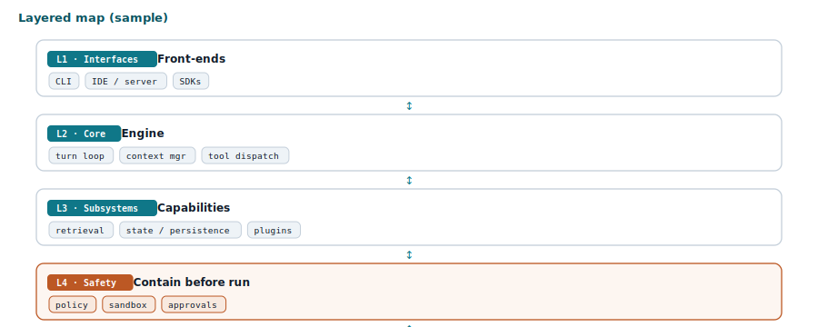

# architecture-from-codebase

**Turn any repository into a polished, self-contained architecture *reference document*** — a single offline HTML file with hand-rendered annotated diagrams, a navigable table of contents, per-section links back to the exact source, and honest *observed-vs-inferred* labeling. Built for [Claude Code](https://claude.com/product/claude-code) and [Claude Cowork](https://claude.com/product/cowork).

Point it at a codebase and get the document you *wish* the repo had: a layered map, tech stack, annotated sequence/ER/flow diagrams, subsystem deep-dives, and a design-rationale table — where every claim traces to a file and nothing is silently invented.

## What you get

A single `.html` artifact (no CDN, no runtime scripts — renders offline forever) containing, as needed:

- **Layered map** and **tech stack** grouped by concern
- **Annotated sequence diagrams** of the key flows, plus one holistic end-to-end flow
- **Subsystem deep-dives** (whatever the codebase actually has: request loop, retrieval, caching, tools, state, plugins…)
- **ER diagram** built from the real schema/migrations
- **Design principles**, **design patterns** (generic + as-applied), and a **rationale table** (decision · why · trade-off)
- **Per-section "Source ↗" links** to the real files/dirs, and a one-line provenance note per section

Diagrams are **hand-rendered inline SVG** (via the bundled generator), not Mermaid or a CDN renderer — so the file is fully self-contained and the annotations are first-class.

## How this is different

There are adjacent tools; this one occupies a specific niche — **producing a shareable, source-traceable architecture reference document.**

- vs. the first-party **engineering** plugin — that stops at ADRs (architecture *decisions*), code review, and README-style docs. This reverse-engineers an *existing* system into a full reference.
- vs. **legacy-reverse-engineering** plugins — those target legacy-modernization (e.g. specific .NET/VB stacks, DDD extraction). This is **language-agnostic** and output-focused.
- vs. **architecture-capture / "second brain"** tools — those build a *queryable knowledge graph* of topology/ownership. This produces a **human-readable document** you can hand to a teammate.

Distinctives: self-contained annotated-SVG HTML, per-section source provenance, observed-vs-inferred honesty, a reusable diagram engine, and **no vector index** (retrieval is agentic + lexical).

## Install

Via a plugin marketplace (once published to your marketplace):

```bash
claude plugin marketplace add super-wisdom/architecture-from-codebase
claude plugin install architecture-from-codebase@architecture-from-codebase
```

Or drop the skill straight into a project: copy `skills/architecture-from-codebase/` into your `.claude/skills/` (or your plugin's `skills/`).

## Use it

Once installed, the skill fires automatically when you ask to understand or document a repo (see [Examples](#examples) below). It drives the whole loop: clone/orient → targeted investigation → per-section drafting with diagrams → incremental assembly → validation → a presented HTML artifact.

## Examples

Try prompts like:

- *"Reverse-engineer this repo into an architecture document."*
- *"Map how this service works — diagram the main request flow."*
- *"I'm onboarding onto this codebase; produce a shareable architecture reference."*
- *"Document the data model as an ER diagram from the migrations."*

Below are sample diagrams produced by the bundled generator, to show the visual style. The plugin assembles **many** such diagrams — with prose, tables, and per-section source links — into one self-contained HTML document.

**Annotated sequence diagram**



**Layered architecture map**



> These are illustrative samples of the diagram style generated by `scripts/seqgen.py` and the diagram recipes — not a screenshot of a full generated document for a specific repo.

## What's inside

```
skills/architecture-from-codebase/
├── SKILL.md                      # the methodology (workflow, section menu, honesty rules, gotchas)
├── scripts/seqgen.py             # reusable annotated sequence-diagram engine (import `Seq`)
└── references/
    ├── design-system.md          # palette, fonts, copy-paste CSS building blocks
    └── diagram-recipes.md        # recipes for block/ER/flow/matrix/terminal-trace + QA workflow
```

## Requirements

- Claude Code or Cowork with a **code-execution environment** (the skill clones the target repo, runs greps, and rasterizes SVGs for QA).
- **Python 3** and **cairosvg** (`pip install cairosvg --break-system-packages`) for the diagram QA step.
- **git** for cloning the target repo and building source links.

## Provenance & honesty

The generated document separates **observed** facts (names/types/values quoted from the tree) from **inferred** interpretation (pattern names, rationale, trade-offs) and **illustrative** examples — and calls out what lives outside the repo. Treat the rationale/trade-off content as well-grounded analysis, not official positions.

## Contributing / submitting to the directory

To list this in the Claude plugin directory, submit your repo at <https://clau.de/plugin-directory-submission>. Before submitting: fill in the `author`, `homepage`, and marketplace placeholders in `.claude-plugin/plugin.json` and above, and set a license below.

## Changelog

See [CHANGELOG.md](./CHANGELOG.md).

## License

MIT — see [LICENSE](./LICENSE).
